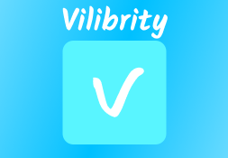

# 🎌 Vilibrity

<div align="center">



> ⚠️ **Важная информация:** !!!Проект разрабатывется при помощи нейросети!!!

**Элегантный и мощный клиент для просмотра аниме на Windows**

*Погрузись в мир аниме с невероятной легкостью*

[](https://www.python.org/)
[](https://www.riverbankcomputing.com/software/pyqt/)
[](https://www.microsoft.com/windows/)

[](#-функции)
[](#-скриншоты)
[](#%EF%B8%8F-установка)

</div>

---

## 📖 О проекте

**Vilibrity** — это кроссплатформенное десктопное приложение, созданное на Python и PyQt6, которое предоставляет удобный и красивый интерфейс для просмотра и каталогизации вашего любимого аниме. Забудьте о неудобных браузерах и навязчивой рекламе — Vilibrity предлагает чистый и сфокусированный опыт.

> ⚠️ **Примечание:** Проект пока что в разработке

---

## ✨ Функции

Вот что делает Vilibrity особенным:

| Функция | Описание |
| :--- | :--- |
| **🎬 Умный поиск** | Мощный поиск с фильтрацией по жанрам, году, статусу и многое другое. |
| **📚 Персональная библиотека** | Создавайте собственные коллекции, добавляйте аниме в "Смотреть позже" и "Любимое". |
| **👁️ Трекинг прогресса** | Приложение автоматически отслеживает, какие эпизоды вы посмотрели. |
| **💾 Встроенный плеер** | Просмотр в высоком качестве прямо в приложении с поддержкой субтитров. |
| **🌙 Ночной режим** | Удобный для глаз темный интерфейс для ночных марафонов. |
| **🚀 Высокая производительность** | Легковесное приложение, которое не нагружает вашу систему. |

---

## 🖼️ Скриншоты

<div align="center">

**Главный экран с каталогом**


**Страница с информацией об аниме**


**Встроенный видеоплеер**


</div>

---

## 🛠️ Технологии

- **Язык программирования:** [Python 3.14+](https://www.python.org/)
- **GUI Framework:** [PyQt6](https://www.riverbankcomputing.com/software/pyqt/)
- **HTTP-клиент:** [Requests](https://docs.python-requests.org/) / [aiohttp](https://docs.aiohttp.org/)
- **Медиаплеер:** [VLC Python Bindings](https://wiki.videolan.org/PythonBinding/) / [MPV](https://mpv.io/)
- **База данных:** [SQLite3](https://www.sqlite.org/index.html) (для кеширования и пользовательских данных)

---

## ⚙️ Установка

Следуйте этим шагам, чтобы запустить Vilibrity на вашем ПК.

### Предварительные требования

1. Убедитесь, что у вас установлен **Python 3.14 или новее**.
2. Установите менеджер пакетов `pip`.

### Пошаговая инструкция

1. **Клонируйте репозиторий:**
   ```bash
   git clone https://github.com/artem3422111/Vilibrity-App.git
   cd vilibrity

2. **Создайте и активируйте виртуальное окружение**
   ```python
   python -m venv venv
   # Для Windows
   venv\Scripts\activate

3. **Установите зависимости**
   ```python
   pip install -r requirements.txt

4. **Запустите приложение**
   ```python
   python main.py